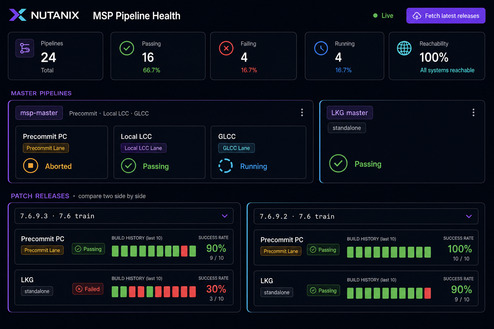

# MSP Pipeline Dashboard

Leadership-facing health board for MSP Jenkins pipelines: **Devtest**, **Master**
(Precommit / Local LCC / GLCC / Smoke) plus standalone **LKG**, and **Patch
Releases**, with automatic version discovery. Slack alerts when a pipeline fails
its last 10 builds, or when a **patch** lane hits `PATCH_FAIL_THRESHOLD`
(default 3).



> **What's new (2026-09-09)**
> - **Patch-release Slack threshold** — `PATCH_FAIL_THRESHOLD` (default 3) alerts
>   on non-master lanes (e.g. `ganges-7.7` LKG) without waiting for 10 failures.
>   Master lanes stay on the 10-fail rule + the 09:00 digest so they are not
>   double-pinged.
> - **Safe digest test** — `POST /api/digest/test` always posts to `#test-msp`
>   and omits `@msp-help`. Response includes `patchCount` / `patchThreshold`.
> - **Master LKG** now on **SB Prod Controller-1** (`Nupipe/LKG/master`), same
>   controller as current versioned LKG (7.6.x, 7.7, …). Harbinger-14 is no
>   longer a discovery source.
> - **Smoke** lane from Controller-1 `Postcommit` (`master` +
>   `ganges-<ver>-stable`).
>
> **Earlier (2026-08-31)** — Slack start/pause (`SLACK_ENABLED`). **(2026-08-26)**
> — three-tab UI, Go port + systemd installer. Go is the recommended deploy path
> (Section A). Node instructions stay below as reference.

## A. Install on another Linux host (recommended)

The Go build is a single statically-linked binary with the web UI embedded, so
the target host needs **no Node, no interpreter, and no `public/` directory**.

**Step 1 — Build the install package** (on any box with Go ≥ 1.23):

```bash
cd pipeline-dashboard/go
make package                    # → dist/packages/*-linux-<arch>.tar.gz
# (defaults to linux/amd64 + linux/arm64; TARGETS="linux/amd64" make package for one)
```

**Step 2 — Copy the tarball to the target host and install:**

```bash
scp go/dist/packages/msp-pipeline-dashboard-*-linux-amd64.tar.gz user@target-host:~

# On the target host:
tar xzf msp-pipeline-dashboard-*-linux-amd64.tar.gz
cd msp-pipeline-dashboard-*/
sudo ./install.sh               # verifies arch, installs to /opt, starts systemd service
```

The installer verifies the binary matches the host architecture, creates the
locked-down `msp-dash` system user, installs `/etc/msp-pipeline-dashboard.env`
(kept on upgrades), and enables the `msp-pipeline-dashboard` service.

**Step 3 — Configure Slack (optional) and restart:**

```bash
sudo vi /etc/msp-pipeline-dashboard.env
sudo systemctl restart msp-pipeline-dashboard
```

Minimum to actually post to the channel:

```ini
SLACK_ENABLED=true
SLACK_BOT_TOKEN=xoxb-...
SLACK_CHANNEL=#test-msp
DASHBOARD_URL=http://<this-host-fqdn-or-ip>:4317
PATCH_FAIL_THRESHOLD=3
```

Leave `SLACK_BOT_TOKEN` / `SLACK_WEBHOOK_URL` unset to run the dashboard in
log-only mode (no channel posts). See **Section B** to start or pause Slack
after install.

**Step 4 — Open a firewall port (if reaching from another machine):**

```bash
sudo firewall-cmd --add-port=4317/tcp --permanent && sudo firewall-cmd --reload   # firewalld
sudo ufw allow 4317/tcp                                                            # ufw
```

**Step 5 — Verify:**

```bash
curl -s http://<target-host-ip>:4317/api/health
curl -s http://<target-host-ip>:4317/api/digest/preview      # who meets the digest threshold
open  http://<target-host-ip>:4317/
```

Manage / remove:

```bash
systemctl status msp-pipeline-dashboard
journalctl -u msp-pipeline-dashboard -f
sudo ./uninstall.sh                         # PURGE=1 to also wipe config + state
```

**Run the Go build ad-hoc (no service):**

```bash
cd pipeline-dashboard/go
make run                                    # or: go build -o msp-pipeline-dashboard ./cmd/dashboard
PORT=4317 HOST=0.0.0.0 ./msp-pipeline-dashboard
```

See `go/README.md` for the full package layout and cross-compile targets.

---

## B. Start and pause Slack on the channel

Three kinds of Slack messages go to `#test-msp` (or `SLACK_CHANNEL`):

| Message | When it fires | How to pause just this one |
|---|---|---|
| **10-fail alert** | A pipeline’s last 10 completed builds are all non-success | `SLACK_ENABLED=false` (or unset the webhook/bot token) |
| **Patch-threshold alert** | A **non-master** lane has ≥ `PATCH_FAIL_THRESHOLD` (default 3) consecutive failures | `SLACK_ENABLED=false`, or raise / unset `PATCH_FAIL_THRESHOLD` |
| **Master digest** | 09:00 IST and 09:00 US-Pacific, only if a master lane has ≥ 5 consecutive failures | `MASTER_DIGEST_ENABLED=false` |

The dashboard itself does **not** stop when Slack is paused. Jenkins polling,
the UI, and `/api/*` keep running.

### Start posting

On the installed host, edit `/etc/msp-pipeline-dashboard.env`:

```ini
SLACK_ENABLED=true
SLACK_BOT_TOKEN=xoxb-...          # Slack app needs chat:write; /invite the bot into the channel
SLACK_CHANNEL=#test-msp
SLACK_MENTION=@msp-help
MASTER_DIGEST_ENABLED=true
```

Then:

```bash
sudo systemctl restart msp-pipeline-dashboard
journalctl -u msp-pipeline-dashboard -n 30 | grep -E 'digest|slack'
# Expect: "Slack bot authenticated as …"  (not "SLACK_ENABLED=false" or auth.test failed)

# Optional: force a digest post right now (uses the real token)
curl -s -X POST http://<host>:4317/api/digest/test
```

One-time Slack app setup: add the `chat:write` bot scope (and `chat:write.public`
if the bot is not in the channel), reinstall the app, then
`/invite @<bot-name>` in `#test-msp`. Never hardcode the token in git.

`SLACK_APP_TOKEN` (`xapp-…`) cannot post. It is unused for outbound messages.

### Pause posting (keep the dashboard up)

```bash
# Pause EVERY Slack post (alerts + digest). Tokens stay in the file.
sudo sed -i 's/^SLACK_ENABLED=.*/SLACK_ENABLED=false/' /etc/msp-pipeline-dashboard.env
sudo systemctl restart msp-pipeline-dashboard
```

While paused, qualifying events are **logged only** (`[slack] (SLACK_ENABLED=false)…`).
Cooldown is not consumed, so the next poll after you resume can post immediately
if a pipeline is still fully failing.

```bash
# Resume
sudo sed -i 's/^SLACK_ENABLED=.*/SLACK_ENABLED=true/' /etc/msp-pipeline-dashboard.env
sudo systemctl restart msp-pipeline-dashboard
```

Pause only the morning digest (10-fail and patch-threshold alerts still post):

```ini
MASTER_DIGEST_ENABLED=false
```

then `sudo systemctl restart msp-pipeline-dashboard`.

Raise or lower the patch-lane bar without touching master:

```ini
PATCH_FAIL_THRESHOLD=3
```

### Pause everything including the dashboard

```bash
sudo systemctl stop msp-pipeline-dashboard     # pause
sudo systemctl start msp-pipeline-dashboard    # start again
```

---

## Node runtime (reference)

The original Node implementation still works and serves the same UI. Two ways to
run it: **install as a service on another Linux host**, or **run ad-hoc** from a
binary/source. Pick one of the sections below.

### Prerequisites

- **Build machine:** Node **≥ 20** (only needed to build the portable binary).
  Check with `node -v`.
- **Target host:** x86-64 Linux with `glibc` (RHEL/CentOS 8+, Ubuntu 20.04+) and
  `systemd`. No Node required if you use the portable package.
- **Network:** the target must reach the read-only Jenkins controllers over
  HTTP/HTTPS (see `PIPELINE-CONTEXT.md` for the list). No secrets are needed for
  status reads.

---

### Node-1. Install as a service on another Linux host

The Node installer sets up a `systemd` service, a config file, and a locked-down
service user — no manual wiring needed.

**Step 1 — Build the package** (on any box with Node ≥ 20):

```bash
cd pipeline-dashboard
npm run package:dist            # → dist/packages/*.tar.gz  (generated; gitignored)
```

Do **not** install a leftover root `dist/` tarball on a host that should run the
Go dashboard — those Node SEA packages bake an older UI. Prefer Section A.

This produces two flavors:

| Package | Needs Node on target? | Use when |
|---|---|---|
| `...-linux-x86_64-portable.tar.gz` | No (bundles the runtime) | x86-64 hosts, incl. old/no Node |
| `...-source.tar.gz` | Yes (Node ≥ 18) | any arch, smaller download |

**Step 2 — Copy the tarball to the target host:**

```bash
scp dist/packages/msp-pipeline-dashboard-*-portable.tar.gz user@target-host:~
```

**Step 3 — Unpack and install** (on the target host):

```bash
tar xzf msp-pipeline-dashboard-*-portable.tar.gz
cd msp-pipeline-dashboard-*/
sudo ./install.sh               # installs to /opt, starts the systemd service
```

The installer auto-picks the runtime (bundled binary if it runs on this host,
otherwise falls back to Node source), creates the `msp-dash` service user, and
enables the service to start on boot.

**Step 4 — Configure and restart.** Edit `/etc/msp-pipeline-dashboard.env` to set
the port/bind address, the public dashboard URL (used in Slack links), and the
Slack bot token + digest schedule:

```bash
sudo vi /etc/msp-pipeline-dashboard.env
```

Minimum recommended settings for Slack posting:

```ini
# Public URL shown as the "Open dashboard" link in Slack (FQDN or IP).
# If omitted, it is auto-derived from the host name/IP + PORT.
DASHBOARD_URL=http://<this-host-fqdn-or-ip>:4317

# Slack bot token (xoxb-…) — required to post the master digest.
SLACK_BOT_TOKEN=xoxb-...
SLACK_CHANNEL=#test-msp

# Master digest: post master pipelines failing >= N builds, at these local times.
MASTER_FAIL_THRESHOLD=5
MASTER_DIGEST_TIMES=09:00 Asia/Kolkata,09:00 America/Los_Angeles

# Patch-release lanes (e.g. ganges-7.7 LKG) alert at this lower streak.
PATCH_FAIL_THRESHOLD=3
```

```bash
sudo systemctl restart msp-pipeline-dashboard
```

> See **Slack app setup** below for the one-time bot scope + channel invite.

**Step 5 — Open a firewall port if reaching it from another machine:**

```bash
# firewalld (RHEL/CentOS):
sudo firewall-cmd --add-port=4317/tcp --permanent && sudo firewall-cmd --reload
# ufw (Ubuntu):
sudo ufw allow 4317/tcp
```

**Step 6 — Verify:** open `http://<target-host-ip>:4317/`, then confirm Slack:

```bash
curl -s http://<target-host-ip>:4317/api/digest/preview      # who meets threshold
curl -s -X POST http://<target-host-ip>:4317/api/digest/test # force a test post
```

Manage the service:

```bash
systemctl status msp-pipeline-dashboard
journalctl -u msp-pipeline-dashboard -f      # live logs
sudo ./uninstall.sh                          # remove (PURGE=1 to wipe config+state)
```

See `packaging/README.txt` (included in each tarball) for full details.

---

### Node-2. Run ad-hoc (no service)

**Option B1 — Portable binary (Node SEA)** — *superseded by the Go binary in
Section A, which is smaller, statically linked, and needs no build toolchain on
the target.* Kept for reference:

```bash
# Build once (needs Node ≥ 20 at build time only):
bash scripts/package-sea.sh          # → dist/msp-pipeline-dashboard

# Copy the single file to any x86-64 Linux host and run:
PORT=4317 ./dist/msp-pipeline-dashboard
```

**Option B2 — From source** (needs Node ≥ 18, zero npm dependencies):

```bash
cd pipeline-dashboard
node server/index.js
# or: npm start
```

The server binds `0.0.0.0` by default, so from **another machine** on the network
just open `http://<vm-ip>:4317`. Restrict to localhost with `HOST=127.0.0.1`.

Port already in use? Start on another port: `PORT=4318 node server/index.js`
(or free it: `fuser -k 4317/tcp`).

The server polls the (read-only) Jenkins controllers every 3 minutes and serves
the dashboard.

## Configuration (all optional, via env vars)

| Env var | Default | Purpose |
|---|---|---|
| `PORT` | `4317` | HTTP port |
| `HOST` | `0.0.0.0` | Bind address (`127.0.0.1` = localhost only) |
| `DASHBOARD_URL` | auto (host name/IP + port) | Public URL for the "Open dashboard" link in Slack |
| `POLL_INTERVAL_MS` | `180000` | Status poll cadence |
| `SLACK_ENABLED` | `true` | Master switch: `false` pauses **all** Slack posts; dashboard stays up |
| `SLACK_BOT_TOKEN` | — | Bot token (`xoxb-…`) used with `chat.postMessage` — required for the master digest |
| `SLACK_APP_TOKEN` | — | App-level token (`xapp-…`); only for Socket Mode later, cannot post |
| `SLACK_ALERT_BOT_TOKEN` | — | Legacy alias for `SLACK_BOT_TOKEN` |
| `SLACK_WEBHOOK_URL` | — | Incoming webhook for the per-pipeline failure alert |
| `SLACK_CHANNEL` | `#test-msp` | Alert/digest channel |
| `SLACK_MENTION` | `@msp-help` | Group to tag |
| `SLACK_COOLDOWN_MS` | `21600000` | Per-pipeline re-alert suppression (6h) |
| `MASTER_DIGEST_ENABLED` | `true` | Toggle the scheduled master digest only |
| `MASTER_FAIL_THRESHOLD` | `5` | Consecutive failures that make a **master** pipeline report-worthy |
| `PATCH_FAIL_THRESHOLD` | `3` | Consecutive failures that make a **patch (non-master)** pipeline alert |
| `MASTER_DIGEST_CHANNEL` | `SLACK_CHANNEL` | Channel for the digest |
| `MASTER_DIGEST_TIMES` | `09:00 Asia/Kolkata,09:00 America/Los_Angeles` | Daily post times (`HH:MM TZ`, DST-aware) |

Example with Slack enabled:

```bash
SLACK_BOT_TOKEN="xoxb-..." node server/index.js
```

## Slack master-pipeline digest

The app can post the health of the **master** pipelines (the `msp-master` group —
Precommit + Local LCC + GLCC + Smoke — plus standalone **LKG**) to Slack on a
schedule.

**Rule:** at each configured time, any master pipeline with **≥ `MASTER_FAIL_THRESHOLD`
(default 5) consecutive build failures** is posted to `MASTER_DIGEST_CHANNEL`
(default `#test-msp`), one entry each with lane, last build number, and a Jenkins
deep link. If nothing is failing, nothing is posted.

**Schedule:** `MASTER_DIGEST_TIMES` — default **09:00 IST** and **09:00 US-Pacific**
each day (timezone/DST-aware, no cron needed).

### Slack app setup (one-time)

The bot token comes from the env var `SLACK_BOT_TOKEN` (`xoxb-…`) — never hardcode
it. At your Slack app (**OAuth & Permissions**):

1. Add the **`chat:write`** bot-token scope (add `chat:write.public` to post to
   channels the bot hasn't joined), then reinstall the app.
2. Invite the bot to the channel: `/invite @<bot-name>` in `#test-msp`.
3. Set `SLACK_BOT_TOKEN` in the environment (or `/etc/msp-pipeline-dashboard.env`)
   and restart.

`SLACK_APP_TOKEN` (`xapp-…`) is **not** required for posting — it is only for
Socket Mode (inbound slash-commands/buttons), which can be added later.

### Test the Slack channel without pinging live traffic

`POST /api/digest/test` is safe to call repeatedly for verification:

- it posts to `#test-msp` regardless of `SLACK_CHANNEL`/`MASTER_DIGEST_CHANNEL`,
- the `@msp-help` mention is **omitted** (failure digest and all-clear) so the
  live channel is not pinged,
- it reports `{ posted, count, patchCount, patchThreshold, reason, channel, slackEnabled, hasBotToken }`.

```bash
curl -X POST http://<host>:4317/api/digest/test | jq

# Expect: "posted": true, "channel": "#test-msp", "slackEnabled": true, "hasBotToken": true
```

> The handler always routes test traffic to `#test-msp` and never tags the group
> mention, so it is safe for routine channel verification.

### Posting workflow

```
poll loop (every 3 min) ──► in-memory snapshot (per-pipeline consecutiveFailures)
           │
           ├─ any pipeline, last 10 completed all failed  ──► Slack 10-fail alert
           └─ patch lane, consecutiveFailures ≥ PATCH_FAIL_THRESHOLD
                                                         ──► Slack patch alert
                                                             (same cooldown)

        daily timer (09:00 IST / 09:00 PT, DST-aware)
                                     ▼
        select master pipelines with consecutiveFailures ≥ MASTER_FAIL_THRESHOLD
                                     ▼
        chat.postMessage  (Bearer $SLACK_BOT_TOKEN)  ──►  digest channel
```

### Test / preview endpoints

```bash
# See who currently meets the threshold (no post):
curl -s http://<host>:4317/api/digest/preview

# Force a digest post right now (uses the real bot token).
# Always goes to #test-msp and omits @msp-help.
# Posts the failing-master digest, or an all-clear if nothing meets the threshold:
curl -s -X POST http://<host>:4317/api/digest/test
```

## Features

- **Auto version discovery** — new `ganges-<version>` patch pipelines show up
  automatically. Click **Fetch latest releases** to force an immediate re-scan.
- **Last-10 build sparkline** per pipeline with hover details, success rate, and a
  consecutive-failure warning.
- **Master section** grouped as `msp-master` (Precommit + Local LCC + GLCC +
  Smoke) with a standalone LKG master on SB Prod Controller-1.
- **Patch-release comparison** — pick any two versions from dropdowns and compare
  their lanes side by side.
- **Slack alert** to `#test-msp` tagging `@msp-help` when the last 10 builds
  fail, or when a patch lane hits `PATCH_FAIL_THRESHOLD` (default 3).
- **Scheduled master digest** at 09:00 IST and 09:00 US-Pacific.
- **Nutanix-themed** UI with live/stale indicator and controller reachability.

See `PIPELINE-CONTEXT.md` for architecture, Jenkins API details, and design
decisions.

## API

- `GET /api/pipelines` — full snapshot JSON
- `GET /api/alerts` — per-pipeline alert history + frequency (count, perDay, avgGapHours, last7Days, last30Days)
- `POST /api/refresh` — force re-discovery + poll
- `GET /api/health` — liveness
- `GET /api/digest/preview` — master pipelines currently ≥ failure threshold (no post)
- `POST /api/digest/test` — verification post to `#test-msp` (no `@msp-help`)
